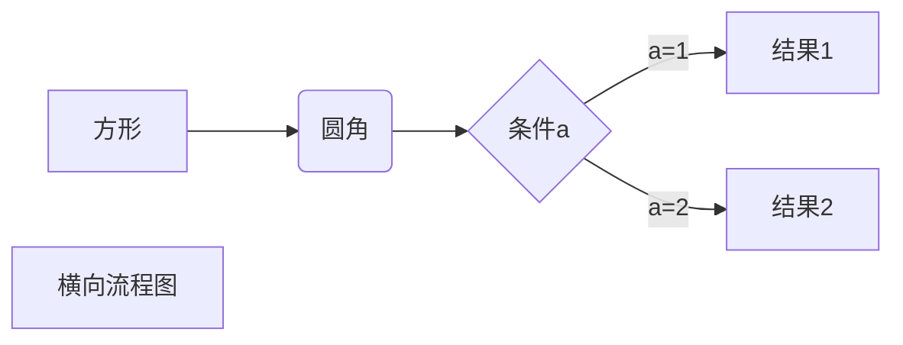
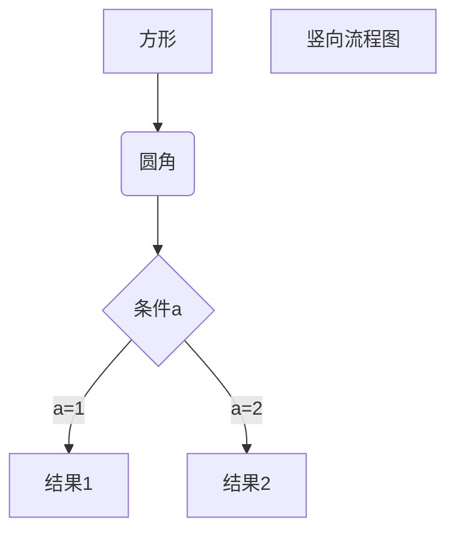

# Markdown 教程

**这是一篇用 Markdown 编写的 Markdown 基础语法教程！**

***

## 一、Markdown 标题篇

### 1,使用 = 和 - 标记一级和二级标题

= 和 - 标记语法格式如下：

我展现的是一级标题
===================

我展现的是二级标题
-------------------

***

### 2,使用#号标记标题

**使用 # 号可表示 1-6 级标题，一级标题对应一个 # 号，二级标题对应两个 # 号，以此类推。**

### 实例

# 一级标题

## 二级标题

### 三级标题

#### 四级标题

##### 五级标题

###### 六级标题

***
***
***

## 二、Markdown 段落篇

**Markdown 段落没有特殊的格式，直接编写文字就好，段落的换行是使用两个以上空格加上回车。**  
**也可以在段落后面使用一个空行来表示重新开始一个段落。**

### 1,字体

**Markdown 可以使用以下几种字体：**

*星标斜体文本*

_下划线斜体文本_  

**双星粗体文本**

__双下划线粗体文本__

***三星粗斜体文本***

___三下划线粗斜体文本___

***

### 2,分隔线

**可以在一行中用三个以上的星号、减号、底线来建立一个分隔线，行内不能有其他东西。也可以在星号或是减号中间插入空格。下面每种写法都可以建立分隔线**

**实例：**

***
* * *

- - -

--------------

### 3,删除线

**如果段落上的文字要添加删除线，只需要在文字的两端加上两个波浪线 ~~ 即可**

**实例：**

www.google.com
www.youtube.com
~~www.pronhub.com~~

***

### 4,下划线

**下划线可以通过 HTML 的 \<u> 标签来实现。**

**实例：**

**<u>带下划线文本</u>**

***

### 5,脚注

**脚注是对文本的补充说明。Markdown 脚注的格式如下：**

[^要注明的文本]

**实例：**

创建脚注格式类似这样 [^ABOUT]
[^ABOUT]: 这是一个脚注实例！！！

***
***
***

## 三、Markdown 列表篇

**Markdown 支持有序列表和无序列表。**

### 1,无序列表

**无序列表使用星号 * 、加号 + 或是减号 - 作为列表标记，这些标记后面要添加一个空格，然后再填写内容：**

**实例：**

* 第一项
* 第二项
* 第三项

+ 第四项
+ 第五项
+ 第六项

- 第七项
- 第八项
- 第九项

***

### 2,有序列表

**有序列表使用数字并加上 . 号来表示。**

**实例：**

1. 第一
2. 第二
3. 第三

***

### 3,列表嵌套

**列表嵌套只需在子列表中的选项前面添加四个空格即可：**

**实例：**

1.第一项：
    - 第一项嵌套的第一个元素
    - 第一项嵌套的第二个元素
2.第二项：
    - 第二项嵌套的第一个元素
    - 第二项嵌套的第二个元素

***
***
***

## 四、Markdown 区块篇

**Markdown 区块引用是在段落开头使用 > 符号 ，然后后面紧跟一个空格符号：**

**实例：**

> 区块应用实例
> Markdown 教程
> 就是这么简单！

***
**区块是可以嵌套的，一个 > 符号是最外层，两个 > 符号是第一层嵌套，以此类推：**

**实例：**

> 最外层
> > 第一嵌套层
> > > 第二嵌套层

***

### 区块中使用列表

**实例：**

> 区块中使用列表
>
> 1. 第一项
> 2. 第二项
>
> + 第一项
> + 第二项

***

### 列表中使用区块

**如果要在列表项目内放进区块，那么就需要在 > 前添加四个空格的缩进。**

**实例：**

* 第一项
    > 列表中使用区块
    > 前面空4个空格
* 第二项

***
***
***

## 五、Markdown 代码篇

**如果是段落上的一个函数或片段的代码可以用反引号把它包起来 ` 反斜杠**

**实例：**

`printf() 函数`

***

### 代码去区块

**代码区块使用 4 个空格或者一个制表符（Tab 键）。**

**实例：**

    #!/bin/bash
    for IP in {170..255}
    do
        ping -c 1  $1.$IP | grep "64 bytes" | tr -d ":" | cut -d " " -f 4 
    done

***

**可以用 ``` 包裹一段代码，并指定一种语言（也可以不指定）**

**实例：**

```bash
#!/bin/bash
a=10
echo $a
```

***
***
***

## 六、Mrakdown 链接篇

**链接的使用方法：**

[链接名称](链接地址)

**或者**

<链接地址>

**实例：**

这是一个链接 [Pronhub](https://www.pronhub.com)

***

**直接使用链接地址：**

<https://www.google.com>

***

### 高级链接

**可以通过变量来设置一个链接，变量赋值在文档末尾进行：**

**实例：**

这个链接用 2 作为网址变量 [Google][2]
这个链接用 github 作为网址变量 [Github][github]
然后在文档的结尾为变量赋值（网址）

[2]: https://google.com/
[github]: https://github.com/

***
***
***

## 七、Markdown 图片篇

**Markdown 图片语法格式：**


**实例：**


***

**也可以像网址那样对图片网址使用变量:**

这个图片链接用 3 作为网址变量 [HazelMoore][3]
然后在文档的结尾为变量赋值

[3]: https://github.com/GuozhangLiao/guozhangliao.github.io/raw/master/docs/109758355_161886312110184_6417260832615727042_n.jpg

***

**Markdown 还没有办法指定图片的高度与宽度，如果你需要的话，你可以使用普通的 \ 标签**

**实例：**


***
***
***

## 八、Markdown 表格篇

**Markdown 制作表格使用 | 来分隔不同的单元格，使用 - 来分隔表头和其他行。**

**语法格式如下：**

| 表头 | 表头 |
| ---- | ---- |
| 单元格 | 单元格 |
| 单元格 | 单元格 |

***

### 对齐方式

**我们可以设置表格的对齐方式：**

* -: 设置内容和标题栏居右对齐
* :- 设置内容和标题栏居左对齐
* :-: 设置内容和标题栏居中对齐

**实例：**

| 左对齐 | 右对齐  | 居中对齐 |
| :----- | -----: | :-----: |
| 单元格 | 单元格 | 单元格 |
| 单元格 | 单元格 | 单元格 |

***
***
***

## 九、Markdown 的高级技巧

### 支持的 HTML 元素

**不再 Mrakedown 涵盖范围之内的标签，都可以直接在文档里面用 HTML 编写。**

**目前支持的 HTML 元素有：\<kbd> \<b> \<i> \<em> \<sup> \<sub> \<br>等。**

**实例：**

使用 <kbd>Ctl</kbd>+<kbd>Alt</kbd>+<kbd>Del</kbd> 重启计算机

***

### 转义

**Markdown 使用了很多特殊符号来表示特定的意义，如果需要显示特定的符号则需要使用转义字符，Markdown 使用 \ 反斜杠转义特殊字符：**

**实例:**

**转义前的效果**

\*\*转义后的效果\*\*

***

**Markdown 支持以下这些符号前面加上反斜杠来帮助插入普通的符号：**

* \\ 反斜杠
* \` 反引号
* \* 星号
* \_ 下划线
* \{} 花括号
* \[] 方括号
* \() 小括号
* \# 井号
* \+ 加号
* \- 减号
* \. 英文句号
* \! 感叹号

***

### 公式

**当你需要在编辑器中插入数学公式时，可以使用两个美元符 \$$ 包裹 TeX 或 LaTeX 格式的数学公式来实现。需要加载 Mathjax 对数学公式进行渲染。**

**实例：**

$$\Gamma(z) = \int_0^\infty t^{z-1}e^{-t}dt\,.$$

$$
f(n)
\begin{cases}
\cfrac n2, &if\ n\ is\ even\\
3n + 1, &if\  n\ is\ odd
\end{cases}
$$

***Markdown 公式应用参考[教程](https://www.jianshu.com/p/25f0139637b7)***

***
***

### 流程图

#### 1、横向流程图源码格式


***

#### 2、竖向流程图源码格式



***

#### 3、标准流程图源码格式

```flow
st=>start: 开始框
op=>operation: 处理框
cond=>condition: 判断框(是或否?)
sub1=>subroutine: 子流程
io=>inputoutput: 输入输出框
e=>end: 结束框
st->op->cond
cond(yes)->io->e
cond(no)->sub1(right)->op
```
